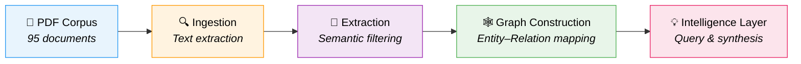
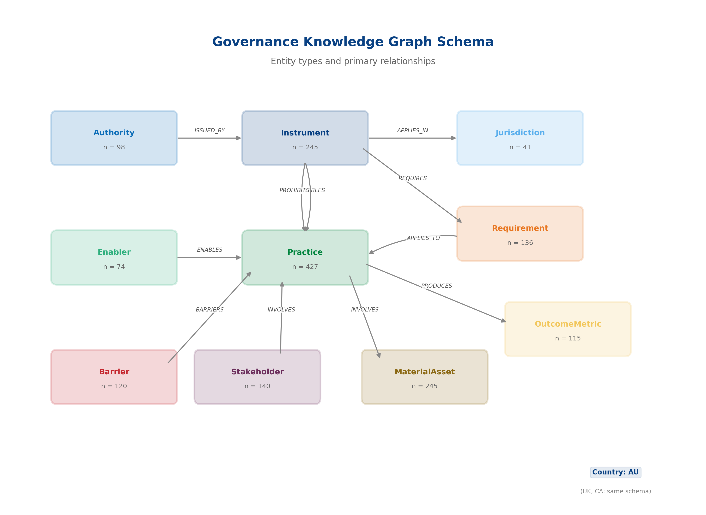
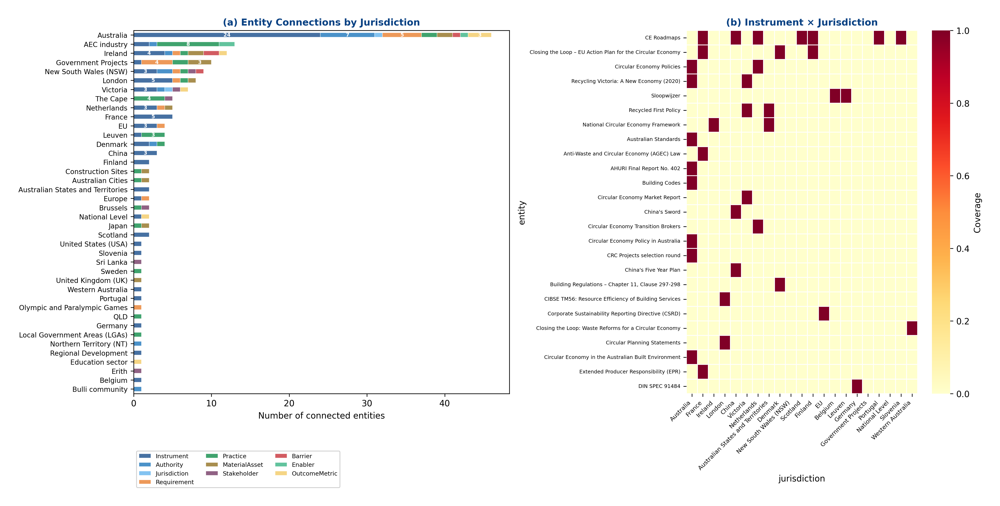
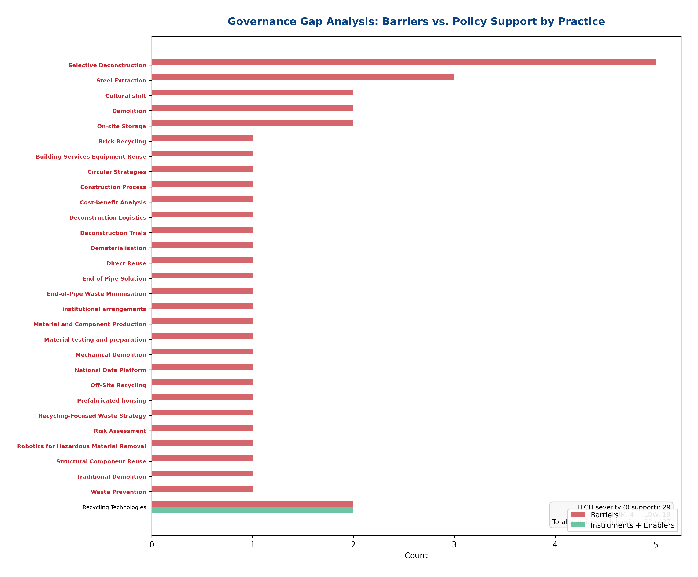

<div align="center">

# Deconstruction GraphRAG

### A Graph Retrieval-Augmented Generation Pipeline for Australian Deconstruction Governance

[]()
[](https://opensource.org/licenses/MIT)


<br>


<br>

*An automated, evidence-linked pipeline that converts unstructured policy instruments into a queryable Knowledge Graph — mapping **Who** governs **What**, **Where**, and **How** across Australia's deconstruction regulatory landscape.*

</div>

---

<table>
<tr>
<td width="50%">

**M. Reza Hosseini** ¹ · **Ruoyu Jin** ² · **Mazdak Nik-Bakht** ³

¹ The University of Melbourne, Australia
² Brunel University London, UK
³ Concordia University, Canada

</td>
<td width="50%">

**Status:** Journal — to be decided · DOI — pending

**Corpus:** 95 Australian policy documents across federal, state & local tiers

**Graph:** Schema-constrained KG with full provenance (source → page → chunk)

</td>
</tr>
</table>

---

## Why This Project?

Australia is transitioning toward a circular built environment, but deconstruction efforts are hindered by **definitional ambiguity** and a **fragmented policy landscape** spanning three tiers of government. Manual document reviews don't scale. This pipeline automates the process — converting hundreds of regulatory PDFs into a structured, queryable knowledge graph with full evidence traceability.

## Key Features

| Feature | Description |
|:--------|:------------|
| **Heterogeneous Data Processing** | Converts complex government PDFs (Acts, regulations, local policies) into machine-actionable text |
| **Precision Filtering** | LLM-driven filtering distinguishes deconstruction/salvage clauses from generic "waste diversion" narratives |
| **Evidence-Linked Knowledge Graph** | Schema-constrained KG preserving strict provenance (source, page, chunk ID) for every claim |
| **Automated Gap Analysis** | Identifies jurisdictional fragmentation and governance deficits where practices lack institutional support |

## The Pipeline



1. **Ingestion** — Processes unstructured PDF corpora from three tiers of government
2. **Extraction** — Performs semantic retrieval and deterministic filtering of salvage-relevant requirements
3. **Graph Construction** — Maps entities and relations (Authority → Instrument → Requirement → Practice → Outcome)
4. **Intelligence Layer** — Supports graph traversal and query-driven synthesis for jurisdictional comparison

## Research Contributions

> **C1** — An end-to-end GraphRAG workflow for regulatory corpus processing
>
> **C2** — An auditable knowledge graph with full metadata provenance
>
> **C3** — Graph-enabled tracing of governance pathways and policy gaps
>
> **C4** — A schema-constrained extraction strategy and comprehensive audit logs

## Sample Outputs

<table>
<tr>
<td align="center" width="33%">
<br>
<sub><b>KG Schema</b></sub>
</td>
<td align="center" width="33%">
<br>
<sub><b>Jurisdiction Heatmap</b></sub>
</td>
<td align="center" width="33%">
<br>
<sub><b>Gap Analysis</b></sub>
</td>
</tr>
</table>

## Repository Structure

```
deconstruction-graphrag/
├── README.md
├── LICENSE
├── .gitignore
├── notebooks/                          # Reproducible Jupyter pipeline
│   ├── 1_Deconstruction_Filter_Pilot.ipynb
│   ├── 2_Deconstruction_Semantic_Filter_Pipeline.ipynb
│   ├── 3_KG_Extraction_v2_EntityRegistry.ipynb
│   ├── 4_KG_Cleanup_MultiCountry_Schema.ipynb
│   ├── 5_Governance_Intelligence_Backend.ipynb
│   ├── 6_Presentation_Outputs.ipynb
│   ├── Table_F1_Figure_F1.ipynb
│   └── findings_after_graph.ipynb
├── data/
│   └── raw/                            # Source data & KG exports
├── docs/                               # Policy PDFs & paper drafts
├── figures/                            # Publication-ready figures & SVGs
└── data_analysis/                      # Pipeline intermediate outputs
    ├── 3_graph_built_v2/
    ├── 4_kg_cleaned/
    ├── 5_backend/
    ├── 6_presentation/
    └── batch_enhanced_KG_outputs/
```

## Quick Start

### Prerequisites

- Python >= 3.10
- Jupyter Notebook / JupyterLab
- An OpenAI-compatible LLM API key

### Installation

```bash
git clone https://github.com/morehosseini/deconstruction-graphrag.git
cd deconstruction-graphrag
pip install -r requirements.txt
```

### Run the Pipeline

```bash
jupyter notebook notebooks/
```

Run notebooks **in order (1 → 6)** to reproduce the full pipeline from raw PDFs to knowledge graph intelligence.

## Tech Stack

<table>
<tr>
<td></td>
<td></td>
<td></td>
<td></td>
</tr>
<tr>
<td></td>
<td></td>
<td></td>
<td></td>
</tr>
</table>

## Citation

If you use this repository in your research, please cite:

```bibtex
@misc{hosseini2026deconstruction,
  author  = {Hosseini, M. Reza and Jin, Ruoyu and Nik-Bakht, Mazdak},
  title   = {Deconstruction GraphRAG: A Graph Retrieval-Augmented Generation
             Pipeline for Australian Deconstruction Governance},
  year    = {2026},
  doi     = {pending},
  url     = {https://github.com/morehosseini/deconstruction-graphrag}
}
```

## Licence

This project is licensed under the **MIT** Licence — see the [LICENSE](LICENSE) file for details.

## Contributing

Contributions are welcome. Please open an [Issue](https://github.com/morehosseini/deconstruction-graphrag/issues) first to discuss proposed changes.

## Contact

**Dr. M. Reza Hosseini**
Senior Lecturer in Construction Technology
Faculty of Architecture, Building and Planning, The University of Melbourne
[Open an Issue](https://github.com/morehosseini/deconstruction-graphrag/issues) · [Email](mailto:mreza.hosseini@unimelb.edu.au)

---

<div align="center">
<i>This repository was prepared in accordance with open-science and FAIR-data principles.</i>
</div>
